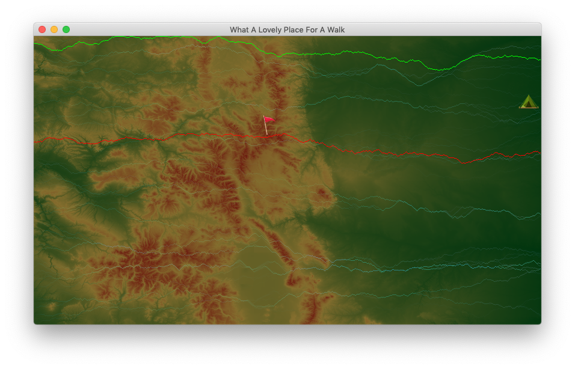

# Elevation Lab

## Build:

`javac App.java`

## Execute:

`java App <file> [--disable-middle-priority]`

where `<file>` can be one of:

- Colorado_844x480.dat
- Europe_1056x544.dat

and `--disable-middle-priority` is an optional flag that will disable the standard middle-priority pathing algorithm, leading to more divergence.

---

*Originally written in Spring 2020*
